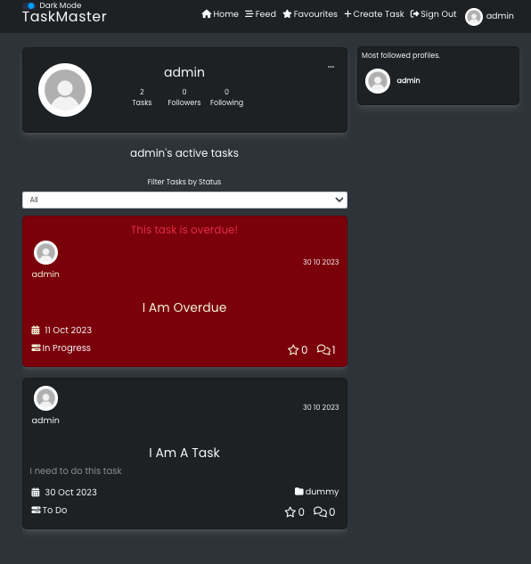

# __TaskMaster - Portfolio Project 5__
Welcome to my 5th Project for Code Institute this is a Advanced Front-End which involves HTML, CSS, JavaScript, Python, React.js and Postgres, this project is deployed through [Heroku](https://heroku.com/).

TaskMaster will help you keep to date with your tasks and see what other people are doing also!


## __Live Site__

The deployed project can be found here - [TaskMaster](https://taskmaster-project-5-1724758f9a1f.herokuapp.com/)

## __Table of Contents__
- [UX & Design](#ux--design)
    - [User Stories](#user-stories)
        - [New User](#new-user)
        - [Existing User](#existing-user)
    - [Agile Methodology](#agile-methodology)
    - [Wireframes](#wireframes)
    - [Colour Scheme](#colour-scheme)
- [Features](#features)
    - [Navigation](#navigation)
    - [Dark Mode](#dark-mode)
    - [Footer](#footer)
    - [Create Task](#create-task)
    - [Update Task](#update-task)
    - [Overdue Task](#overdue-task)
    - [Login Page](#login-page)
    - [Signup Page](#signup-page)
    - [Notes](#notes)
    - [Profile Page](#profile-page)
    - [Edit Profile](#edit-profile)
    - [Edit Username](#edit-username)
    - [Edit Password](#edit-password)
- [](#)
- [](#)
- [](#)
- [](#)
- [](#)
- [](#)
- [](#)

## __UX & Design__
&nbsp;  
### __User Stories__

#### __New User__:
- As a first-time site visitor I can clearly understand the site's purpose so that I can decide whether or not to keep exploring the website
- As a non-signed up user I can visibility see the sign in/sign up options so that I can sign in or make an account

#### __Existing User__:
- As a user I can easily navigate through the website so that I can find the content I am looking for with ease
- As a user I can create an account so that I can access all the features of the website
- As a user I can sign in so that I can access the feature for signed in users
- As a user I can clearly see that I am logged in so that I am aware of my current logged in status
- As a user I can be able to navigate the website without being logged out so that I have the choice when I am logged out
- As a Site User I can add new tasks so that I can remind myself on what to do
- As a Site User I can edit my tasks so that I can change something if I make a mistake
- As a Site User I can delete my tasks so that I can remove tasks that are not needed anymore
- As a Site User I can set a status for my tasks so that I know which tasks I am currently doing
- As a Site User I can add a due date so that I can prioritise my tasks
- As a Site User I can see which tasks are overdue so that I can clearly see what needs doing first
- As a Site user I can move my tasks so that it can reflect the current status
- As a Site User I can filter my tasks so that I can clearly see depending on the filtered option

&nbsp;  
### __Agile Methodology__

The Agile Methodology was used to plan this project, this was done using Github and the Project Board which can be seen here - [Project-5 User Stories](https://github.com/users/LesterCuasay/projects/4)

Whilst I was working through my websited, the Kanban board included three sections:

- Todo
- In Progress
- Done


&nbsp;
### __Wireframes__

As part of my planning stage I created a base design using [Figma](https://www.figma.com/). At this point of the planning stage, I did not know what colour scheme I was going to use although, I knew how I wanted to layout the website.

__Desktop__


__Mobile__


&nbsp;
### __Colour Scheme__

As my project uses dark mode, these is my colour palette


The colours are used in a root variable inside my App.module.css so I can access the colours easier and change them globally if needed.

```css
:root {
  --bg-color: #dee2e6;
  --second-bg-color: #ced4da;
  --main-text: #212529;
  --second-text: #6c757d;
  --card-color: #e9ecef;
  --toggle-bg: #fff;
  --toggle-fg: #dcd7d7;
}

[data-theme="dark"] {
  --bg-color: #343a40;
  --second-bg-color: #212529;
  --main-text: #f8f9fa;
  --second-text: #adb5bd;
  --card-color: #6c757d;
  --toggle-bg: #283452;
  --toggle-fg: #00a6ff;
}
```
## __Features__
&nbsp;  
### __Navigation__

- The navigation bar appears on every page of the website, Each of the links will send the user to the targeted pages. After succesful login, the user will see a prompt of their logged in status to the right of the navbar including their profile image and name.


&nbsp;  
### __Dark Mode__

- The Dark Mode toggle is located on the top left of the navbar which users can interact with and have a light or dark background


&nbsp;  
### __Footer__

- The footer is set to be at the bottom and has links to my github and linkedin pages


&nbsp;  
### __Create Task__

- When a user is logged in they can access this page and be able to create a new task using the form


&nbsp;  
### __Update Task__

- When the user creates a task and mistakenly inputted wrong data, they can update it using this from through the TaskPage the fields will already be populated with the data given from creating the task


&nbsp;  
### __Overdue Task__

- When the task is past its due date the task container will turn to red to inform the user owner that they have missed their deadline, This will only show in the task page if the current user is the task owner and also this will show in their profile page if again the current user is the task owner and profile owner


&nbsp;  
### __Login Page__

- When the user has signed up they can use this form to log in and access logged in features of the website


&nbsp;  
### __Signup Page__

- If the user has no account they can sign up using this form


&nbsp;  
### __Notes__

- If the user is logged in they can comment on a selected task, also if they are the owner of the comment they can edit and delete their posted note.


&nbsp;  
### __Profile Page__

- Any users can access this page, but when it is a logged in user they can follow another user using this page or by the most followed profiles.



&nbsp;  
### __Edit Profile__

- The logged in user can access this by going to their profile page and click on the drop down menu, they can change their profile image and bio in this page


&nbsp;  
### __Edit Username__

- The logged in user can access this by going to their profile page and click on the drop down menu, they can change their username in this page which will already be populated with their current username


&nbsp;  
### __Edit Password__

- The logged in user can access this by going to their profile page and click on the drop down menu, they can change their password using this page


&nbsp;  

