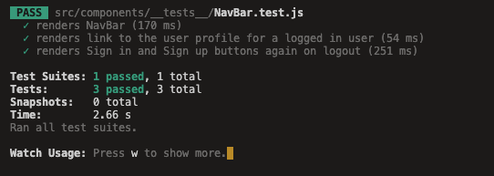
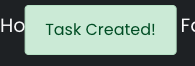
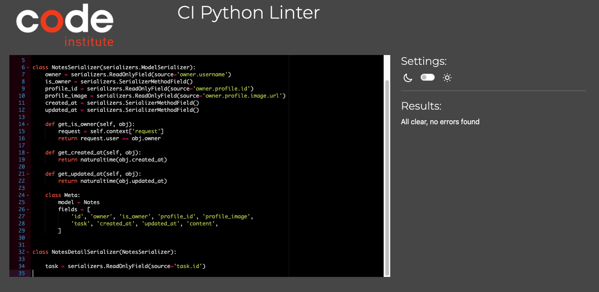

# __Testing__

Head back to the [README.md](README.md) file.

&nbsp;
## __Table of Contents__
- [Frontend](#frontend)
    - [Automated Testing](#automated-testing)
    - [Manual Testing](#manual-testing)
        - [HTML Validator](#html-validator)
        - [CSS Validator](#css-validator)
        - [ESLint Validation](#eslint-validation)
        - [Lighthouse](#lighthouse)
        - [Console](#console)
        - [Alerts](#alerts)
            - [Authentication](#authentication)
            - [Tasks](#tasks)
            - [Notes](#notes)
            - [Profile](#profile)
        - [Bugs](#bugs)
- [Backend](#backend)
    - [Automated Testing](#automated-testing-1)
    - [Manual Testing](#manual-testing-1)
        - [Tasks App](#tasks-app)
            - [Models](#models)
            - [Serializers](#serializers)
            - [Views](#views)
            - [Tests](#tests)
        - [Notes App](#notes-app)
            - [Models](#models-1)
            - [Serializers](#serializers-1)
            - [Views](#views-1)
        - [Profiles App](#profiles-app)
            - [Models](#models-2)
            - [Serializers](#serializers-2)
            - [Views](#views-2)
        - [Followers App](#followers-app)
            - [Models](#models-3)
            - [Serializers](#serializers-3)
            - [Views](#views-3)
        - [Favourites App](#favourites-app)
            - [Models](#models-4)
            - [Serializers](#serializers-4)
            - [Views](#views-4)

# __Frontend__

&nbsp;
## __Automated Testing__

Jest was setup by adding the below code to the [setupTests.js](https://github.com/LesterCuasay/Project-5/blob/main/frontend/src/setupTests.js) to utilise the mocks/handler.js file to simulate users logging in and logging out. The code stated below starts a simulated browser and shuts it down after each test is run. The handler.js creates a user object and accesses the base url and dj-rest-auth/logout/ to test user authentication.

```js
import "@testing-library/jest-dom";
import { setupServer } from "msw/node";
import { handlers } from "./mocks/handlers";

const server = setupServer(...handlers);

beforeAll(() => server.listen());
afterEach(() => server.resetHandlers());
afterAll(() => server.close());
```

Although, as my project is unified to get the tests to pass a few changes has to be made in various files:

[axiosDefaults.js](https://github.com/LesterCuasay/Project-5/blob/main/frontend/src/api/axiosDefaults.js) line 3:

```js
// axios.defaults.baseURL = "/api";
axios.defaults.baseURL = "http://localhost:8000/";
```

[settings.py](https://github.com/LesterCuasay/Project-5/blob/main/taskmaster_api/settings.py) line 124:

```py
'DIRS': []
# 'DIRS': [os.path.join(BASE_DIR, 'staticfiles', 'build')],,
```

[urls.py](https://github.com/LesterCuasay/Project-5/blob/main/taskmaster_api/urls.py) line 22:

```py
urlpatterns = [
    path('', root_route),
    path('admin/', admin.site.urls),
    path('api-auth/', include('rest_framework.urls')),
    path('dj-rest-auth/logout/', logout_route),
    path('dj-rest-auth/', include('dj_rest_auth.urls')),
    path(
        'dj-rest-auth/registration/',
        include('dj_rest_auth.registration.urls')
    ),
    path('', include('profiles.urls')),
    path('', include('tasks.urls')),
    path('', include('notes.urls')),
    path('', include('followers.urls')),
    path('', include('favourites.urls')),
]
```

After these changes the tests will pass, this was the only fix I could find to get the tests to pass as because my project in development runs using localhost:8000.

- I created 3 tests utilising the Jest testing suite, all of the tests is for [NavBar.test.js](https://github.com/LesterCuasay/Project-5/blob/main/frontend/src/components/__tests__/NavBar.test.js) the test is to see if the correct navigation links are shown to a logged in user versus a logged out user.

Test results:



&nbsp;
## __Manual Testing__

### __HTML Validator__


&nbsp;
### __CSS Validator__


- CSS was validated through W3C Jigsaw, which passed. However there were warnings displayed although this was related to React Bootstrap which does not affect my Custom CSS's performance.

&nbsp;
### __ESLint Validation__

- All validation fixes recommended by ESLint were fixed shown in this [commit #6c20706](https://github.com/LesterCuasay/Project-5/commit/6c2070656907dddb6ed0be046c246045ed2a8094)

&nbsp;
### __Lighthouse__

- Lighthouse Desktop


- Lighthouse Mobile


&nbsp;

### __Console__

#### __Logged Out__


- The browser shows 3 errors, but this is expected as the user is logged out so there are no user/token to get/post

&nbsp;
#### __Logged In__


- The browser errors are now gone as the user is logged in

&nbsp;
### __Alerts__

- All the alerts shown in this section is displayed next to the navbar so it is easily seen by the user:


#### __Authentication__
- On the signup page if a user clicks the sign up button without any entry this error will show:


- If the username they choose already exists this error will show:


- If the password is too short this error will show:


- If the password does not match this error will show:


- On successful signup this prompt will show:


- On the signin page if a user clicks the sign in button without any entry this error will show:


- If the user does not exist this error will show:


- On successful signin this prompt will show:


 
&nbsp;
#### __Tasks__

- On the Create Task form, if the user clicks the create buttom without any entry this error will show:


- On successful creation this prompt will show:



- On successful update this prompt will show:


- On successful deletion this prompt will show:


&nbsp;
#### __Notes__

- On the notes section of the TaskPage, when a user creates a note this prompt will show:


- On successful update this prompt will show:


- On successful deletion this prompt will show:


&nbsp;
#### __Profile__

- On the ProfilePage, when a user edits their profile this prompt will show:


- On the ProfilePage, when a user edits their username this prompt will show:


- On the ProfilePage, when a user edits their password this prompt will show:


&nbsp;
### __Bugs__

- There are no bugs that I am aware of.

&nbsp;
# __Backend__

## __Automated Testing__

To check if my views are correctly working, I implemented automation testing, the results for all tests is shown below:


&nbsp;
## __Manual Testing__

To validate my code written in Python, I will be using [Code Institute's Python Linter](https://pep8ci.herokuapp.com/) to make sure that my code has no errors.

&nbsp;

### __Tasks App__

#### __Models__

[tasks/models.py](https://github.com/LesterCuasay/Project-5/blob/main/tasks/models.py)


&nbsp;
#### __Serializers__

[tasks/serializers.py](https://github.com/LesterCuasay/Project-5/blob/main/tasks/serializers.py)


&nbsp;
#### __Views__

[tasks/views.py](https://github.com/LesterCuasay/Project-5/blob/main/tasks/views.py)


&nbsp;
#### __Tests__

[tasks/tests.py](https://github.com/LesterCuasay/Project-5/blob/main/tasks/tests.py)


&nbsp;
### __Notes App__

#### __Models__

[notes/models.py](https://github.com/LesterCuasay/Project-5/blob/main/notes/models.py)


&nbsp;
#### __Serializers__

[notes/serializers.py](https://github.com/LesterCuasay/Project-5/blob/main/notes/serializers.py)



&nbsp;
#### __Views__

[notes/views.py](https://github.com/LesterCuasay/Project-5/blob/main/notes/views.py)


&nbsp;


